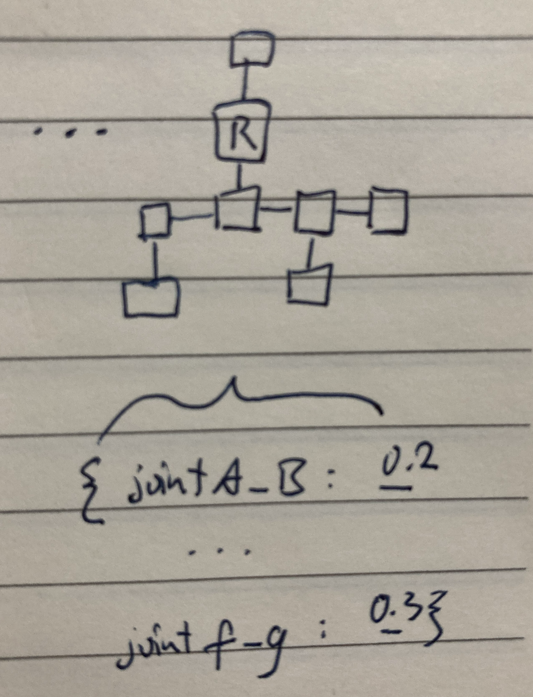
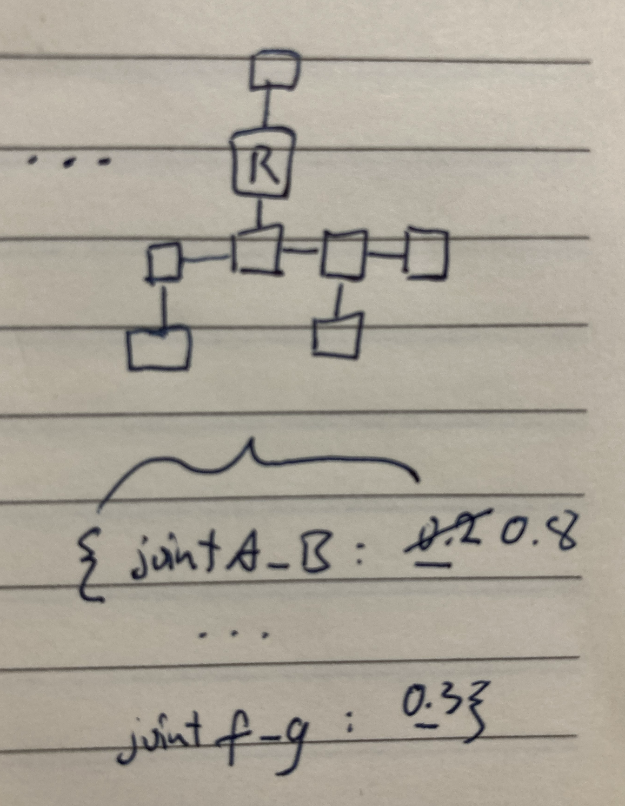
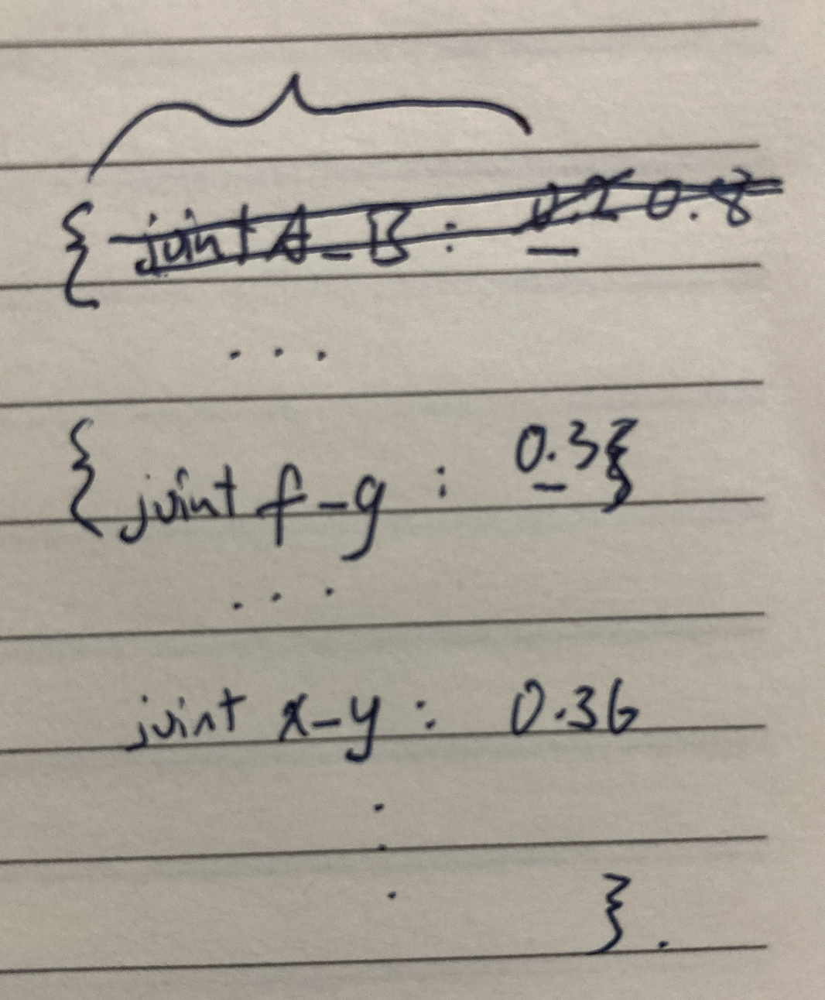
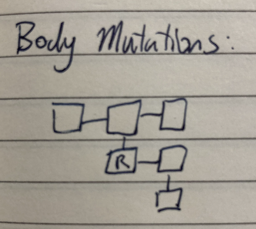
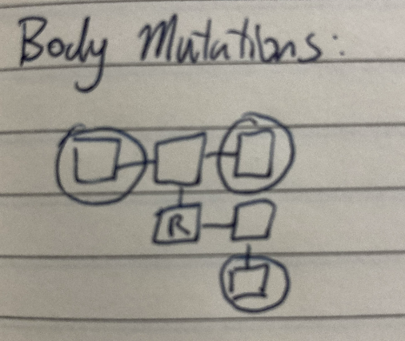
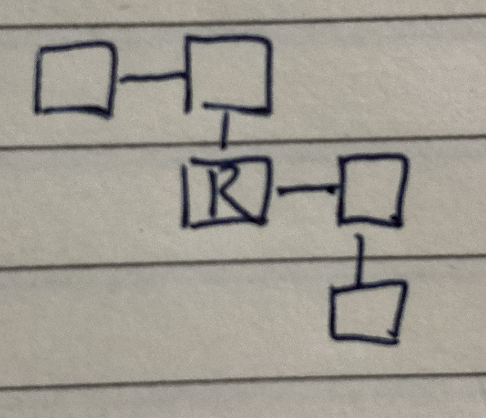
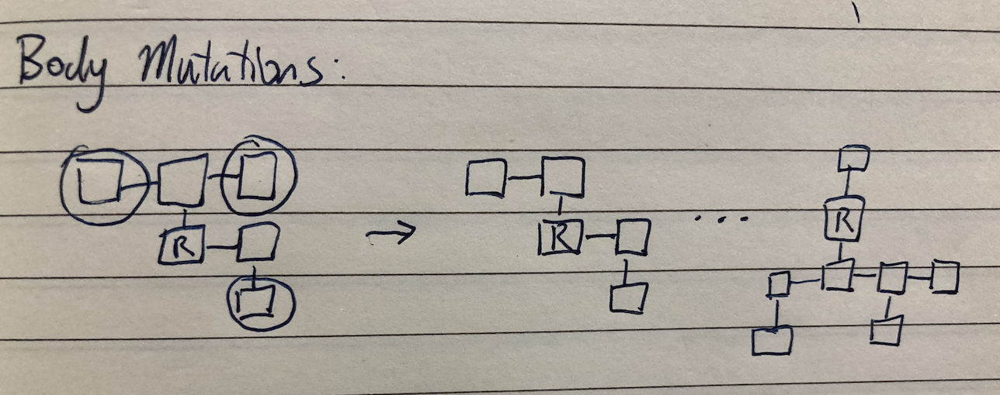
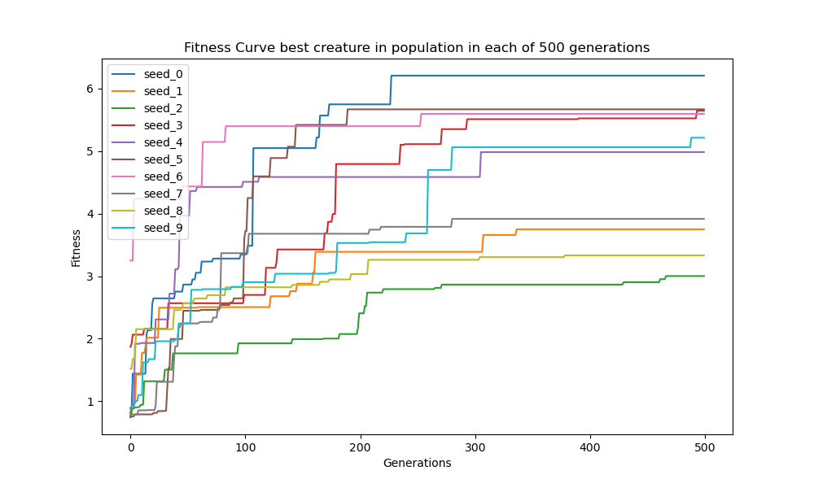
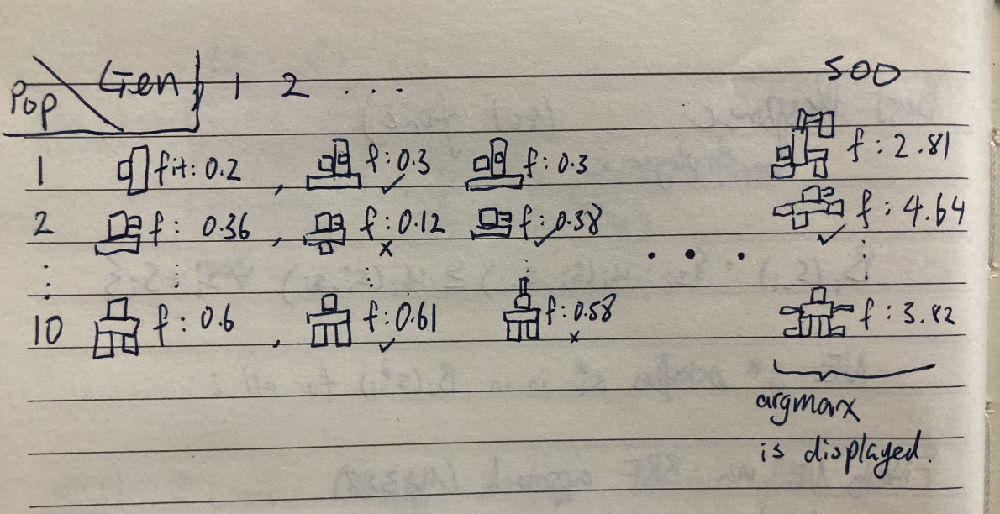

# Assignment 8

This project is an assignment for a course at Northwestern University, [CS 396 Artificial Life](https://www.mccormick.northwestern.edu/computer-science/academics/courses/descriptions/396-2.html). The assignments are based on [Ludobots](https://www.reddit.com/r/ludobots) and use [pyrosim](https://github.com/jbongard/pyrosim).

## What is this?

This builds upon a previous work that randomly generates 3D creatures and performs a parallel evolutionary algorithm on it to learn movement. The creatures each have a number of randomly placed sensors along their bodies which control motors placed at their joints according to random weights in their brain. For each population group, a template body and brain is generated. Each successive generation performs a mutation where a random weight in the neural network that represents the brain is modified in hopes of better performance. With a probability p, a random leaf node is also removed in the hopes that a change in body structure will help push the evolution process to have better candidates that optimizes movement.

## Running the project

In the project directory, run:

`
python search.py
`

or to just view an example evolved creature, run:

`
python play.py
`

or to see a non-evolved creature, run:

`
python show_nonevolved.py
`

Note: you may need to point the Python binary to something different as I use miniconda's python binary path

## Simulation Parameters
- seeds: 10
- population size: 10
- generations: 500

Depending on the machine tested, running 1 seed of population size 10 for 500 generation takes anywhere between 30 minutes to 1 hour. The plot was generated with a script that ran the 10 seeds overnight on a remote server. I chose to not do more population sizes because it was sufficient to see interesting behavior with the above parameters and more simulations means higher electricity cost and as an environmentalist I want to minimize my harm to the environment.

## Laws of Physics (OBEYED)
The construction of bodies starts with a root node that is above the floor in the simulated world. A comprehensive collision detection is coded to ensure that spawned limbs do not spawn inside other limbs. However, movement of such limbs are allowed to be in close proximity of other limbs in order to study what if we allowed joints to have non-natural (but feasible) range of motion. All spawning of limbs, limb sizes, joints, and axis of movement parameters are done so randomly.

## Video
[Here]() is the link to the video

## Teaser

# Method & Explanations
### Morphospace

Creatures consist of anywhere between 5 to 20 body segments ('links'). Each body segment is a cube with each dimension randomly ranging from 0.5 to 1.0 unit. Each successive body part can be attached to any face of the cubes in the already existing body with a joint that rotates around the x, y, or z axis. This allows for an enormously large morphospace with relatively low complexity. One glaring restriction to the morphospace of these creatures is that the joint graph must be a DAG. These creatures are not capable of having cyclic joint connections, which could have opened the door to some really interesting results.

Each link's generation is checked against the links that have been generated to ensure no spawning parts that reside within the existing structure. (See examples). 
The datastructure used to store the information of the body parts are a combination of an abstracted class `Box` which stores internal information about the links and their relation to the overall structure. Lists and dictionaries are used to store information about Boxes' existence in the spawned world and information about sensors and motor joints. The parameters for the brain are stored in a dictionary. All of this code is in `snake.py` subclass of `Solution`. 

Here is an example of how a creature could be generated. The blue and green squares are body parts and the red arrows show how the body parts are connected by joints. In structure mutation only leaf links are candidates for deletion. This is ensured by my class structure `Box` that has a linked structure which connects to parent Box objects. 

### Brain

The brain is a matrix of weights connecting the sensors to the joints. Each creature has sensors randomly spread throughout its body. Each sensor affects every joint in the creature. The brain can be represented as a complete bipartite graph of sensors and joints. 

Here the yellow circles represent sensors and the red squares represent joints.

### Mutation
In each successive generation within a population group, one motor neuron's parameters will be randomly altered in an attempt to produce more evolutionary stable and successful creatures. 

<!-- A | B | C
- | - | - -->
   

At the same time, with probability parameter p, one 'leaf' node of the body structure will be removed and with probability parameter q (p > q) one more body part will be spawned from current terminal nodes. The idea behind this is that when originally experimenting with different body sizes for generating creatures it was found that smaller, less complex morphologies had a higher chance of generating successful movement patterns that maximized distance traveled. Hence, while we also increase links, we do so at a lower probability of removing links so that the final result is a "pruned" version of the originally spawned morphology where movement is optimized.

  

### Selection
Selection is done within across population group across generations. We employ a greedy approach where the structure and brain of the furthest moving morphology is kept as the base upon which we evolve further structures and brains. The fitness plot over time as seen in the section below shows 'jumps' of fitness increase and plateaus. This indicates that for that specific population group, some structure has had no successful mutations and hence fitness stays the same, until a mutation in another population group becomes much better and overtakes the previous base structure and the process continues.

### Example Generation

## Results
Running 10 population groups over 500 generations, seeds 0 to 9

What did you find? 
I found that smaller, simpler structures tend to have better movement since the search complexity of a large structure for an evolutionary algorithm does not scale linearly. 
Typically, the parameters for the joints that spawned in the creature either tend towards a high value (jerky movement) or low value (insignificant movement). This makes sense as through time some joints may have a large impact on the overall structure's movement while others may be detrimental and if that joint was not removed during the evolutionary process, it solves an optimization problem that seeks to maximize total structure movement distance which will drive joints' parameters to either max or min in the limit. There were many times that evolution got stuck as seen in the plot below. We see this also doesn't scale linearly. The longer it takes, the harder it is to evolve some structure that has a much better fitness. If we look back to our natural world's history it is arguably the same. For instance in the cambrian explosion many lifeforms were formed but overtime these stablized and the surviving species did not evolve too much over the millenium. Some robots, purely due to chance, just had harder time to grow structures that had limbs protruding out to help with movement. For instance, a structure that spawned initially like a wall would have a hard time evolving to move well. Something that can be done about this is to kill off certain simulations after some threshold of minimal evolutionary activity hasn't been met. (This also helps the environment by using less compuational resources). 

