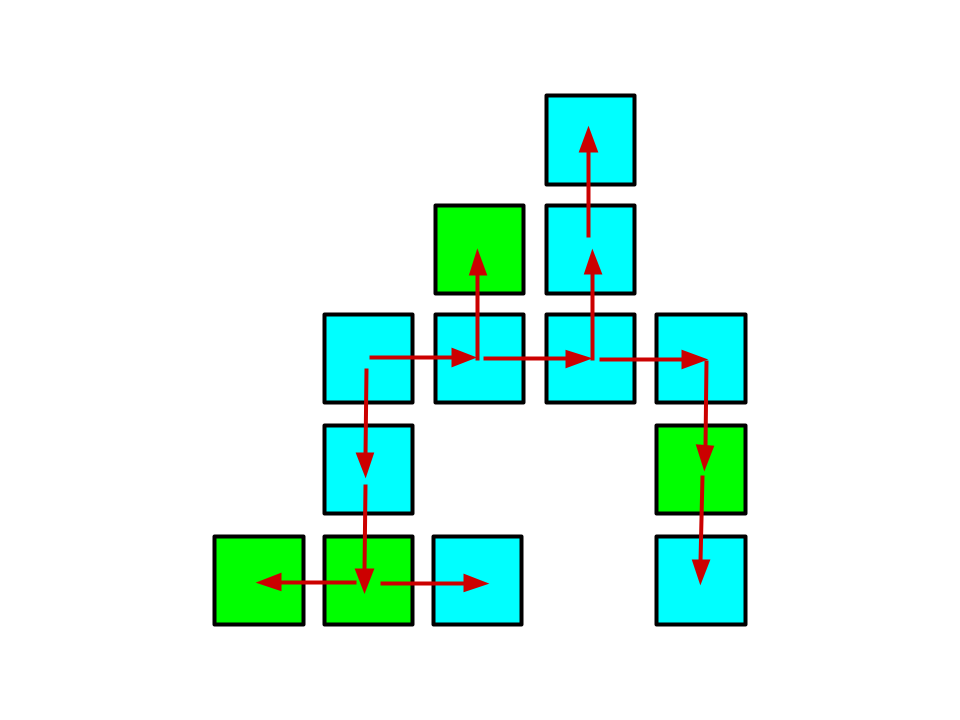
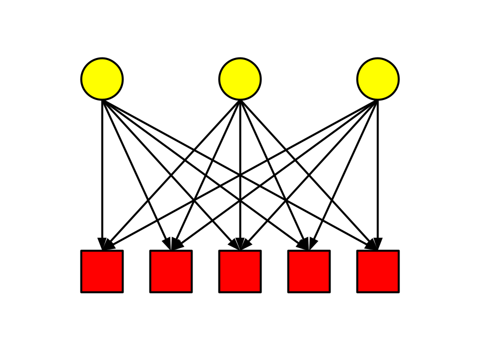
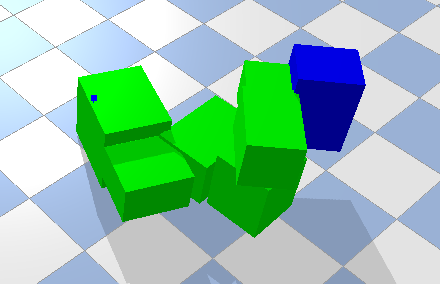
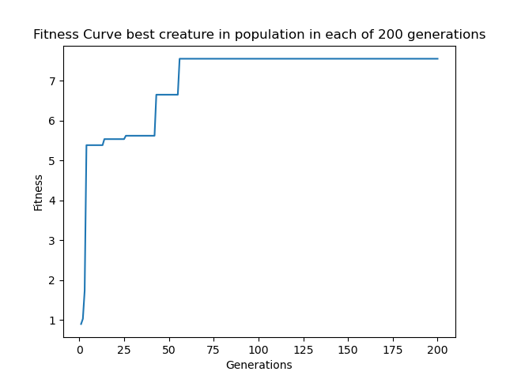
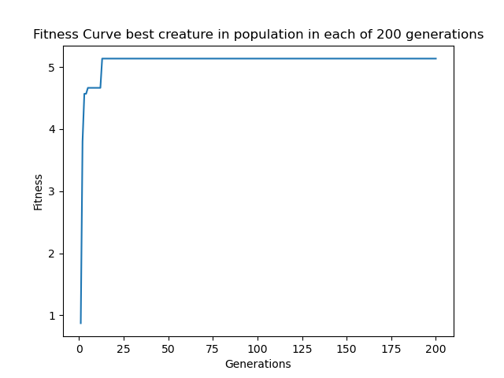
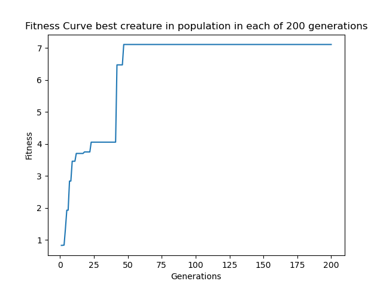
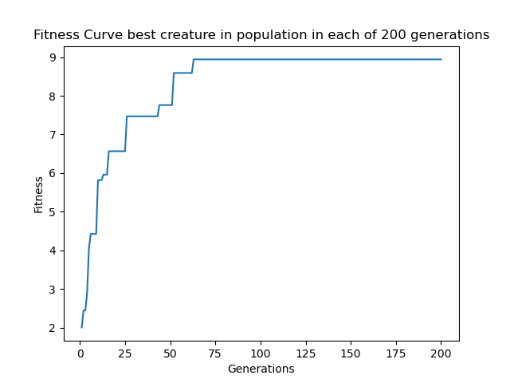

# Assignment 8

This project is an assignment for a course at Northwestern University, [CS 396 Artificial Life](https://www.mccormick.northwestern.edu/computer-science/academics/courses/descriptions/396-2.html). The assignments are based on [Ludobots](https://www.reddit.com/r/ludobots) and use [pyrosim](https://github.com/jbongard/pyrosim).

## What is this?

This builds upon a previous work that randomly generates 3D creatures and performs a parallel evolutionary algorithm on it to learn movement. The creatures each have a number of randomly placed sensors along their bodies which control motors placed at their joints according to random weights in their brain. For each population group, a template body and brain is generated. Each successive generation performs a mutation where a random weight in the neural network that represents the brain is modified in hopes of better performance. With a probability p, a random leaf node is also removed in the hopes that a change in body structure will help push the evolution process to have better candidates that optimizes movement.

## Morphospace

Creatures consist of anywhere between 5 to 20 body segments ('links'). Each body segment is a cube with each dimension randomly ranging from 0.5 to 1.0 unit. Each successive body part can be attached to any face of the cubes in the already existing body with a joint that rotates around the x, y, or z axis. This allows for an enormously large morphospace with relatively low complexity. One glaring restriction to the morphospace of these creatures is that the joint graph must be a DAG. These creatures are not capable of having cyclic joint connections, which could have opened the door to some really interesting results.

Each link's generation is checked against the links that have been generated to ensure no spawning parts that reside within the existing structure. (See examples). While body generation will ensure no intersection of body parts, the movement on body parts may have an intersection. 

Here is an example of how a creature could be generated. The blue and green squares are body parts and the red arrows show how the body parts are connected by joints. In structure mutation only leaf links are candidates for deletion. This is ensured by my class structure `Box` that has a linked structure which connects to parent Box objects. 

## Brain

The brain is a matrix of weights connecting the sensors to the joints. Each creature has sensors randomly spread throughout its body. Each sensor affects every joint in the creature. The brain can be represented as a complete bipartite graph of sensors and joints. 

Here the yellow circles represent sensors and the red squares represent joints.

## Example Generation

## Running the project

In the project directory, run:

`
python search.py
`

or to just view an example evolved creature, run:

`
python play.py
`

or to see a non-evolved creature, run:

`
python show_nonevolved.py
`

Note: you may need to point the Python binary to something different as I use miniconda's python binary path

## Results
Running 20 population groups over 200 generations, seeds 0,1,2,3,4

